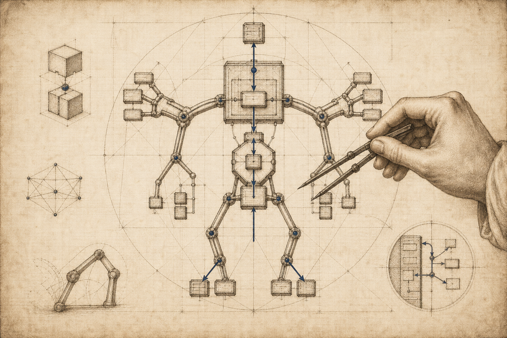

<p align="center">
  
</p>

# Da Vinci

**A disciplined workspace for AI-assisted engineering.**

Da Vinci helps engineers use AI without surrendering engineering judgment. It makes design
visible before code, establishes explicit pairing roles, and turns outside-in TDD into a
repeatable operating rhythm.

The engineer remains in control. Da Vinci provides the instruments: design rehearsal,
constrained AI pairing, continuous verification, and durable engineering knowledge.

In these docs, **Da Vinci** is the project; **the workshop** is the practice environment it
creates.

## Why “Da Vinci”?

The name carries two ideas.

**Leonardo studied anatomy to understand how a body works as a system.** He looked past the
surface to the structures, joints, and relationships underneath. Da Vinci applies that lens to
software: before refining a class or method, draw the body plan: what objects exist, what
messages move between them, where substitution matters, and what each part refuses to know.

**The [da Vinci surgical system](https://www.intuitive.com/en-us/patients/da-vinci-robotic-surgery/about-the-systems/)
amplifies skilled human control.** It does not replace the surgeon. In the same way, this
workshop treats AI as an instrument guided by an accountable engineer. Not as an autonomous
author whose plausible output becomes the design by default.

Read the fuller rationale in [Why Da Vinci?](docs/WHY_DA_VINCI.md).

## The operating loop

```text
Mission
  → Slice the work by risk
  → Rehearse the body plan
  → Write an honest failing acceptance test
  → Pair under an explicit mode
  → Run the red → green → refactor loop
  → Review the anatomy and commit the slice
```

Da Vinci makes each transition concrete:

| Stage | Artifact or tool | What it protects |
|---|---|---|
| Define the outcome | `MISSION.md` | Scope and shipping order |
| Rehearse the design | `ANATOMY.md` + the seven-station rock drill | Object boundaries, joints, and refusals |
| Prove the body walks | Acceptance test + `bin/drill-check` | Real behavior and honest wiring |
| Pair deliberately | Pairing modes and short signals | Human ownership of the work |
| Keep feedback live | `bin/watch` | The outside-in TDD rhythm |
| Preserve learning | `bin/note` | Decisions, findings, gotchas, and lessons |

## Try the worked example

Requirements: a recent Ruby and [`entr`](https://eradman.com/entrproject/). Optional integrations
include your preferred editor launcher and the GitHub CLI for issue-backed missions.

```bash
git clone https://github.com/tommy2118/da-vinci.git
cd da-vinci
bin/doctor
bin/workshop examples/conway-game-of-life/SLICE_01_walking_skeleton
```

`bin/doctor` reports missing dependencies and installation hints. `bin/workshop` then arranges
the three things every slice needs: an editor, a test watcher, and an AI pair. The default
`manual` launcher only prints commands, so it works with any editor and any AI CLI.

## Start your own mission

Step zero, when you have a problem-shaped thing but not yet a mission. One command scaffolds
a discovery-ready mission and opens the workspace with the LLM in `scout` mode, so it can
research and investigate before you drill:

```bash
bin/start order-claims
```

`bin/start` asks for the problem, an existing repo (if any), and a tracker item (GitHub issue,
ClickUp, Linear). It infers the mission shape and boots discovery. When you can state the
mission in one sentence and list the slices, you drill and build:

```bash
bin/new-slice order-claims walking-skeleton
bin/drill-check order-claims/SLICE_01_walking-skeleton
bin/workshop order-claims/SLICE_01_walking-skeleton
```

If you already know the mission and want to skip discovery, `bin/new-rep order-claims`
scaffolds the mission directly.

Slice 1 is always a walking skeleton: the smallest end-to-end path through the real stack,
using hard-coded behavior where necessary, that proves the system is wired before domain logic
accumulates on top.

## Choose how the AI pairs

The active pairing mode defines who may write, when the work changes hands, and what kind of
feedback the AI should provide.

| Mode | Working agreement |
|---|---|
| `navigator` | The AI prescribes precise moves; you type every line |
| `coach` | You write; the AI asks questions and names design smells |
| `ping-pong` | You write a failing test; the AI writes the smallest pass; you refactor |
| `constraint` | You work freely under declared design constraints |
| `true-pair` | You drive and hand the AI bounded implementation tasks |

Short signals such as `next`, `diff`, `smell`, `run`, `red`, `green`, and `drill` keep the
pairing rhythm explicit. See the [Pairing Protocol](PAIRING_PROTOCOL.md) for the full contract.

## Three ways to use it

1. **Self-contained kata**: practice one technique in isolation; code lives in the slice.
2. **External-target mission**: rehearse here while implementation lands in an existing repo.
3. **GitHub-project mission**: bind an Epic to a mission and Task issues to slices.

All three use the same loop. They differ only in where code lands and where work is tracked.

## Documentation

- [Why Da Vinci?](docs/WHY_DA_VINCI.md): the product philosophy and limits of AI assistance
- [Concepts](docs/CONCEPTS.md): missions, slices, drills, pairing modes, and the two TDD loops
- [Workflows](docs/WORKFLOWS.md): complete walkthroughs for all three mission shapes
- [Discipline](docs/DISCIPLINE.md): anatomy-first OO, GOOS §1–§6, and the adapter registry
- [Rock Drill Protocol](ROCK_DRILL_PROTOCOL.md): the seven-station design rehearsal
- [Pairing Protocol](PAIRING_PROTOCOL.md): modes, signals, handoffs, and review behavior
- [GitHub Project Shape](GITHUB_PROJECT_SHAPE.md): the Epic/Task/Projects integration contract
- [Conway’s Game of Life](examples/conway-game-of-life): a finished mission to read end to end

## Configuration

Copy the local configuration example, then choose a launcher and (optionally) a separate home for
your private missions and engineering notes:

```bash
cp .workshoprc.local.example .workshoprc.local
```

| Setting | Purpose |
|---|---|
| `WORKSHOP_LAUNCHER` | `manual`, `tmux`, `vscode`, `cursor`, or `emacs` |
| `WORKSHOP_CONTENT_DIR` | Separate personal missions and notes from the shared framework |
| `WORKSHOP_AI_CMD` | Select the AI pair command |
| `WORKSHOP_TEST_CMD` | Define the test command for the active slice |

The committed `.workshoprc` provides shared defaults. `.workshoprc.local` adds per-machine
overrides, and each slice may override both.

## Repository map

```text
bin/            Mission, slice, drill, note, watcher, launcher, and GitHub commands
docs/           Product philosophy, concepts, discipline, and workflows
templates/      Scaffolds for missions, slices, tests, and notes
examples/       Fully worked practice missions
lib/  test/     The Ruby implementation and its tests
visual-rockdrill/ Browser-based rehearsal interface
```

## What Da Vinci is not

Da Vinci is not an autonomous coding agent, a prompt collection, or a substitute for review.
It is a practice environment for making engineering judgment visible, testable, and repeatable
while AI assists with the work.

---

Da Vinci is an independent software project inspired by Leonardo da Vinci’s anatomical studies
and the general model of human-controlled, computer-assisted work. It is not affiliated with or
endorsed by Intuitive Surgical.
