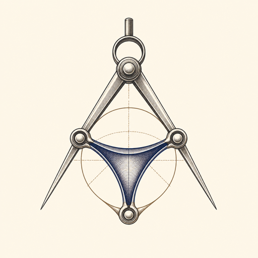

  

# Why Da Vinci?

Da Vinci is built on a specific claim: **AI should amplify engineering judgment, not make that
judgment disappear.**

The name connects two useful models for how that relationship should work.

## Study the anatomy before touching the cells

Leonardo da Vinci studied anatomy to understand the body beneath its surface. His drawings did
not merely catalog isolated parts. They investigated structure, movement, proportion, and the
relationships that allowed the whole organism to function.

Software has the same two levels:

- **Cellular detail** is the implementation inside a part: methods, conditionals, queries,
  names, and data structures.
- **Anatomy** is the system of relationships: what objects exist, what messages move between
  them, where the joints are, what owns each decision, and what each object refuses to know.

AI is unusually fluent at cellular detail. It can produce clean, idiomatic, well-tested code
for the wrong anatomy. The output may look convincing while ownership is scattered,
collaborators are hidden, and substitution requires surgery.

Da Vinci creates a deliberate pause before that failure. Its rock drill asks the engineer to
draw the system, identify the joints, write refusal lists, walk the message flow, and audit for
bypass paths before implementation begins.

## Keep the operator in control

Computer-assisted surgery offers a second model: the trained human remains responsible for the
procedure while the system improves visibility, reach, and precision.

That division of responsibility matters in engineering:

| The engineer owns | AI may assist with |
|---|---|
| The problem and desired outcome | Exploring the existing system |
| Architectural and object-design decisions | Proposing implementation options |
| The boundaries and substitution seams | Writing bounded cellular changes |
| Acceptance criteria and risk | Running checks and reporting evidence |
| Whether the result is safe to ship | Reducing mechanical effort |

The tool should make the engineer’s decisions easier to inspect—not obscure them behind fluent
generation.

## The body-plan test

Before non-trivial work, ask:

1. What level of work is this?
2. Can I draw the system?
3. Where are the joints?
4. What owns each decision?
5. What does each object refuse to know?
6. What proves the body walks?
7. Where could the body plan be bypassed?

These questions are the center of Da Vinci. The CLI, templates, pairing modes, watcher, and
notes system exist to make answering them part of the workflow rather than an aspiration.

## Assistance needs constraints

An unconstrained AI pair tends toward plausible momentum. Da Vinci replaces that ambiguity with
explicit modes:

- A navigator may prescribe but not type.
- A coach may question but not take over.
- A ping-pong partner receives the ball only after a failing test.
- A constraint imposer evaluates work against declared rules.
- A true pair accepts bounded handoffs and then returns control.

The constraint is not friction around the collaboration. It is the shape of the collaboration.

## Tests make the anatomy observable

The body plan cannot be verified by reading classes in isolation. It becomes visible when tests
exercise the relationships between objects.

Da Vinci therefore keeps two loops running:

- The outer acceptance loop proves that the real body can move.
- The inner unit loop shapes the joints and reflexes of each part.

Mocks accelerate the inner loop. They do not establish correctness. The outer loop catches the
places where a mock lied or a substitution seam existed only in theory.

## The intended result

Da Vinci is successful when an engineer can explain not only what the code does, but also:

- why each object exists;
- which decisions it owns;
- which details it refuses to know;
- how its collaborators can be replaced;
- which test proves the real path works; and
- where a future change might create a second nervous system.

The goal is not more AI-generated code. The goal is stronger engineers using powerful
instruments with precision.

---

Da Vinci is an independent software project. It is not affiliated with or endorsed by
Intuitive Surgical.
