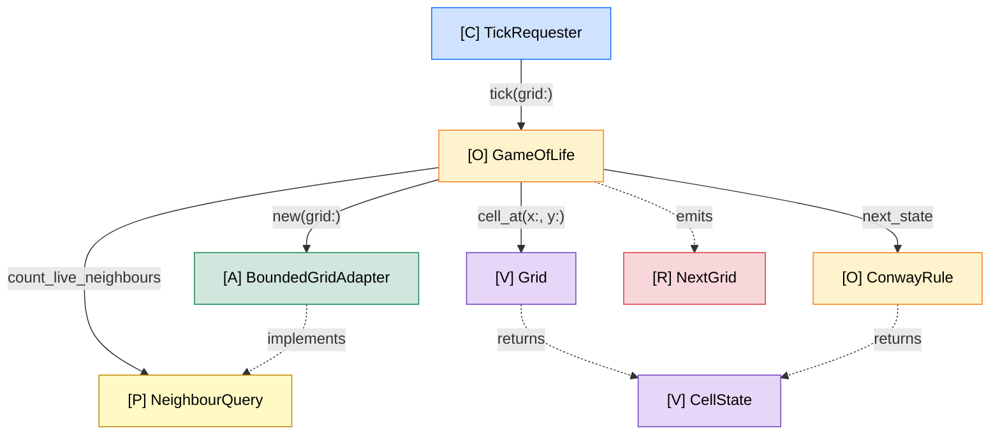
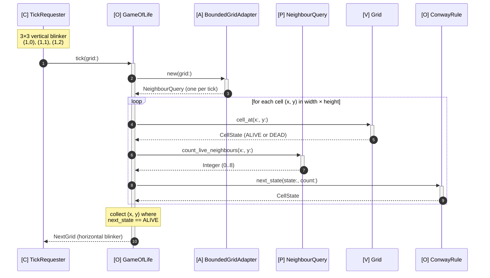
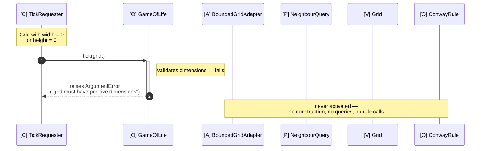

# Slice 02 — rule_engine

> **Scope**: Apply Conway's 4 rules to every cell of the input Grid and emit a NextGrid whose live cells are computed from neighbour counts and prior state; introduce `[O] ConwayRule` and `[V] CellState`, and remove slice 1's hardcoded blinker return.

Mission: `conway-game-of-life` · Drilled via [rock drill](../../ROCK_DRILL_PROTOCOL.md) stations 3-7.

---

## Collaborators

> **How to think**: Start at the caller. What enters the system, what receives it, what message travels where? Follow the messages outward until you hit a leaf. Each box gets a role symbol; each arrow names a message and its return shape.
>
> **Heuristic**: *Can I draw it?* If you can, the anatomy is visible. If arrows go everywhere, it's tangled. If one box owns every arrow, you found a god object. Cap at ~5-7 boxes — more and the slice is too big.
>
> **Watch for**: arrows you can't name, boxes you can't justify, vendor SDKs sitting next to your own objects (wrap them — §1).

```
[C] TickRequester      :: Entry: hands a Grid in, receives NextGrid out.
[O] GameOfLife         :: Orchestrates: iterate cells, ask rule, build NextGrid.
[P] NeighbourQuery     :: Counts live neighbours of cell (x,y) in a Grid.
[A] BoundedGridAdapter :: NeighbourQuery for a finite grid; off-grid = dead.
[V] Grid               :: Immutable live-cell set with width/height; answers cell state at coords.
[R] NextGrid           :: Grid emitted by one tick; same shape, one gen forward.
[O] ConwayRule         :: Pure rule: given (state, neighbour count) -> next state.
[V] CellState          :: Alive | Dead — value type for cell states (two singletons).

[C] TickRequester -> [O] GameOfLife#tick(grid:)                            returns [R] NextGrid
[O] GameOfLife    -> [A] BoundedGridAdapter.new(grid:)                     returns a [P] NeighbourQuery (factory: one per tick)
[O] GameOfLife    -> [P] NeighbourQuery#count_live_neighbours(x:, y:)      returns Integer
[O] GameOfLife    -> [V] Grid#cell_at(x:, y:)                              returns [V] CellState
[O] GameOfLife    -> [O] ConwayRule#next_state(state:, neighbour_count:)   returns [V] CellState
```

**Legend**: `[C]` caller · `[O]` core object · `[P]` port · `[A]` adapter · `[V]` value · `[R]` result · `->` owned call · `=>` cross-seam handoff · `~>` publication · `?` proof step

### Rendered

Same anatomy as a Mermaid graph (renders in any Mermaid-aware viewer; colors require renderer support for `classDef`).



**Reading the rendering**:
- Solid arrows (`-->`) = owned message calls. These are the joints that need test doubles in the Joints section below.
- Dashed arrows (`-.->`) = type / value flows (return shapes, "implements" relationships, emissions). Not separate calls.

## Joints

> **How to think**: A joint is any place substitution matters — the seams between owned objects, and the boundary where you wrap external types. For each arrow ask: *what would I have to replace to test this in isolation?*
>
> **Heuristic**: Real > Fake > Stub > Mock (§5). Owned > External (§1). Every collaborator should have a real default in the constructor (§4). If a test would need `allow_any_instance_of` or `stub_const`, the joint should have been injected.
>
> **Watch for**: arrows whose test double is "I'll just mock the class directly" — that's a missing injection. Time, randomness, env, logger, jobs are joints too (§6) — not language features.

| Arrow | Real default | Test double |
|-------|--------------|-------------|
| `[C] TickRequester -> [O] GameOfLife#tick(grid:)` | `GameOfLife.new` (all kwargs default) | none at slice 2 — caller is the spec |
| `[O] GameOfLife -> [A] BoundedGridAdapter.new(grid:)` | `BoundedGridAdapter` (the class); per tick `BoundedGridAdapter.new(grid: grid)` | anonymous `double("NeighbourQuery factory")` for single-use; promote to `spec/support/fakes/fake_neighbour_query_factory.rb` if reused 5+ times (§5) |
| `[O] GameOfLife -> [P] NeighbourQuery#count_live_neighbours(x:, y:)` | per-tick adapter from row above | `FakeNeighbourQuery` (named, in `spec/support/fakes/`) — slice 2 specs configure board patterns where multiple cells need specific counts; reused enough to justify a named fake (§5) |
| `[O] GameOfLife -> [V] Grid#cell_at(x:, y:)` | the input grid (no double) | **real Grid** — value object is frozen and cheap; per §5 prefer real over fake when fast and owned |
| `[O] GameOfLife -> [O] ConwayRule#next_state(state:, neighbour_count:)` | `ConwayRule.new` | **real ConwayRule** for integration specs (pure & fast); anonymous `double("ConwayRule")` only when isolating GameOfLife from rule semantics |

Notes per arrow:
- `tick(grid:)`: Pure function — same input grid always yields same NextGrid; no side effects.
- `BoundedGridAdapter.new(grid:)`: One adapter per tick, wrapping that tick's input grid.
- `count_live_neighbours(x:, y:)`: Returns 0..8; never raises.
- `cell_at(x:, y:)`: Returns `CellState::ALIVE` or `CellState::DEAD`. **Raises on out-of-bounds coords** — off-grid handling is BoundedGridAdapter's job, not Grid's.
- `next_state(state:, neighbour_count:)`: Pure function. Returns `CellState`.

## Refusals

> **How to think**: For each box, ask *what would surprise me if this object knew?* That's the refusal. Refusal is design. An object with no refusal list is not designed yet — it's only named.
>
> **Heuristic**: 2-4 refusals per box. Bullets phrased "Does NOT know X" — the negative framing is doctrinal. Each bullet should describe responsibility owned by *another* object in your diagram, or out of scope entirely.
>
> **Watch for**: refusals that describe implementation details ("doesn't use a Hash"). Those are cellular, not anatomical. Refusals are about what the object's role excludes.

### `[C] TickRequester`
- Does NOT know Conway's rules.
- Does NOT mutate the Grid.

### `[O] GameOfLife`
- Does NOT know how cells are stored (delegates to Grid).
- Does NOT know the grid topology (bounded vs toroidal — delegates to NeighbourQuery via the adapter).
- Does NOT know the *content* of Conway's rules (which counts → alive/dead) — delegates to ConwayRule.
- Does NOT decide off-grid neighbour semantics — that's BoundedGridAdapter's job.

### `[P] NeighbourQuery`
- Does NOT know Conway's rules.
- Does NOT decide a cell's next state.
- Does NOT mutate the Grid.

### `[A] BoundedGridAdapter`
- Does NOT know Conway's rules.
- Does NOT mutate or own the Grid.
- Does NOT decide a cell's next state.

### `[V] Grid`
- Does NOT know Conway's rules.
- Does NOT mutate; any change returns a new Grid.
- Does NOT answer about out-of-bounds coords — raises instead. Off-grid semantics belong to BoundedGridAdapter.

### `[R] NextGrid`
- Does NOT know how it was computed.
- Does NOT know about rendering or display.

### `[O] ConwayRule`
- Does NOT know about Grid structure, storage, or coordinates — only takes (state, count) and returns next state.
- Does NOT know about iteration — it's a pure per-cell function.
- Does NOT know about topology (bounded vs toroidal) — works for any integer neighbour count.
- Does NOT mutate its inputs.

### `[V] CellState`
- Does NOT know Conway's rules.
- Does NOT know about Grid coordinates or neighbour counts.
- Does NOT mutate (singletons are frozen).
- Does NOT have intermediate states — only Alive and Dead.

## Walk-through

> **How to think**: Trace the happy path out loud, one message per step. Each step uses only the boxes and arrows from `Collaborators`. If a step needs something you didn't draw, *you found a missing collaborator* — go back and add it before continuing.
>
> **Heuristic**: Each numbered step = one message send. Use exact names from the diagram. Mark each step with `?` to denote "the acceptance test will prove this step."
>
> **Watch for**: steps that mention concepts not in the diagram. The walk is the design diagnosing itself — listen to it.

### Happy path
1. ? [C] TickRequester hands a 3×3 Grid with vertical blinker (live cells `(1,0), (1,1), (1,2)`) to [O] GameOfLife.
2. ? [O] GameOfLife constructs [A] BoundedGridAdapter.new(grid: grid) once for this tick.
3. ? [O] GameOfLife iterates each cell `(x, y)` for `x in 0...width`, `y in 0...height`.
4. ? For each cell, [O] GameOfLife asks [V] Grid#cell_at(x:, y:) → [V] CellState (ALIVE or DEAD).
5. ? For each cell, [O] GameOfLife asks [P] NeighbourQuery#count_live_neighbours(x:, y:) → Integer (0..8).
6. ? For each cell, [O] GameOfLife asks [O] ConwayRule#next_state(state:, neighbour_count:) → [V] CellState.
7. ? [O] GameOfLife collects `(x, y)` coords where `next_state == CellState::ALIVE`.
8. ? [O] GameOfLife emits [R] NextGrid via Grid.with(width:, height:, live_cells: [(0,1),(1,1),(2,1)]) — the horizontal blinker.

**Rendered:**



### Failure path
(Inherited from slice 1's anatomy, never implemented — slice 2 closes the gap.)

1. ? [C] TickRequester hands a Grid with `width = 0` or `height = 0` to [O] GameOfLife.
2. ? [O] GameOfLife raises `ArgumentError("grid must have positive dimensions")` immediately; no adapter construction, no rule calls, no [V] Grid#cell_at calls, no NextGrid emitted.

**Rendered:**



The visual point of the failure path is *what doesn't happen*: four lifelines stay quiet. The bypass-audit row about "Grid construction boundary catches width=0" is what *also* prevents this path from being reachable in well-formed clients.

## Bypass risks

> **How to think**: Where could a future change route around this design? Where might a tired dev "just reach in"? The catastrophic failure mode isn't "we forgot the pattern" — it's "we followed the pattern in one place and bypassed it somewhere else." The anatomy growing a second nervous system.
>
> **Heuristic**: Minimum 3 named risks, each with a mitigation. Mitigations come in flavors: *enforcement* (a cop), *structure* (a value object that can't be misused), *convention* (helper method, acceptance test pattern), or *accepted* ("live with it, monitor"). An empty audit is dishonest.
>
> **Watch for**: vague mitigations ("be careful"). Risks that don't describe *bypassing* — those are general project risks. This section is specifically about second paths around the design.

| Risk | Likelihood | Mitigation |
|------|-----------|------------|
| [O] ConwayRule's rule numerics (2, 3) leak back into [O] GameOfLife as inline conditionals (`if count == 3 ...`) — anatomical erosion of the new rule object | high | All Conway integer literals (0, 1, 2, 3) live only in `ConwayRule`. GameOfLife integration specs are pattern-driven (blinker, block) and assert *outcomes*, not counts. ConwayRule unit specs are the only place naming specific counts. |
| [V] CellState is compared as a primitive (symbol / boolean / string) instead of as a value object | medium | `Grid#cell_at` returns `CellState`, not boolean — forces callers to speak CellState vocabulary. CellState has no `to_sym` / `to_s` / coercion. All tests use `CellState::ALIVE` / `CellState::DEAD` literally. |
| Slice 1's mitigations get dropped because slice 2's `lib/` starts fresh — Grid not frozen, `Grid.new` still public, no port-call interaction spec | high | Treat slice 1 → slice 2 transition as a known regression point. First re-derivation moves carry over: `freeze` in initializer, `private_class_method :new`, interaction spec for the port call. Auditable: the slice 1 ANATOMY.md is the checklist. |
| Caller bypasses [O] GameOfLife's dimension check by constructing a `width=0` / `height=0` Grid directly | medium | Validation lives at the Grid construction boundary (`Grid.with` and the private `Grid.new` raise on non-positive dimensions). GameOfLife's check becomes defense-in-depth. |

---

## Verification checklist

> *Drill instrument — fold mentally once green. The rest of this document is the artifact a reader picks up cold; this section is for the drill operator.*

- [x] One-screen test — anatomy diagram fits one terminal screen (14 lines, widest ~100 chars).
- [x] One-sentence test — scope reminder reads as a single statement (semicolon-joined clauses describing the same change).
- [x] Refusal-list completeness — 8/8 boxes have 2+ refusal bullets.
- [x] Joint completeness — 5/5 arrows have real default + test double + notes.
- [x] Walk test — happy path (8 steps) and failure path (2 steps) reference only objects/messages in Collaborators.
- [x] Red-shape test — acceptance assertion uses `expect(...).to eq(...)`; well-formed. Initial red against the empty slice 2 `lib/` will be plumbing (`LoadError`), as in slice 1; assertion-red appears once scaffolding lands.
- [x] Bypass-audit honesty — 4 named risks, each with a mitigation.
- [x] Timer test — drill stayed well under 30 minutes (interactive drafting).

When all eight pass, the drill is done. Write the acceptance test stub; that's what ends the drill.

---

## Scratch (live notes during the slice)

<!-- Append "we are here" notes here when pausing mid-slice. -->
